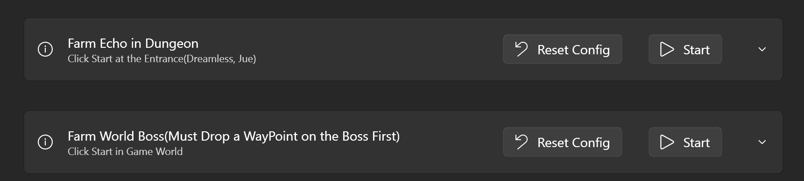

<div align="center">
  <h1 align="center">
    
    <br/>
      ok-ww
  </h1> 
<h3><i>Automation for Wuthering Waves using computer vision and win32api</i></h3>
</div>


[](https://github.com/ok-oldking/ok-wuthering-waves/releases)
[](https://github.com/ok-oldking/ok-wuthering-waves/releases)
[](https://qm.qq.com/q/ufUCrCEq6A)


Join our [](https://discord.gg/Sy6etyCRed)

Watch the demo and tutorial on [](https://youtu.be/apalaRDDmVw)

### English | [简体中文](README_cn.md)




## Key Features

* Farm Boss Echo (Dreamless, Jue, and World Bosses)
* Auto Combat in Abyss, Game World, Tacet Field, etc.
* Auto Skip Dialogs in Quests
* Auto Pick-up (Echos, Flowers, Chests)
* Supports All Game Languages (Most Features)

### Usage (Run from Compiled .exe)

* Download `ok-ww.7z` from the latest releases
* Extract and double-click the `ok-ww.exe`

### Usage (Run from Python Source Code)

Use Python 3.12, other versions might work but are not tested.

```
git clone https://github.com/ok-oldking/ok-wuthering-waves
pip install -r requirements.txt #install python dependencies
python main.py # run the release version
python main_debug.py # run the debug version
python main_gpu_debug.py # run the gpu debug version
python main_gpu.py # run the gpu release version
```
### Must Set Game Settings


### FAQ

1. Do not extract in a directory with non-English characters.
2. Add the download and extraction directories to the antivirus software or Windows Defender whitelist, then extract the
   files again.
3. If you encounter an error when running the program, try extracting the files again.
4. You may need to turn off Windows HDR, eye protection low blue light mode, and automatic application color management
   in advanced display settings. Use default brightness for games, disable all features that change game colors, like
   Nvidia/AMD game filters/sharpening, and close any overlays displaying FPS, GPU information, etc.
5. If you are not using the default QER keys, change the keys in the ok-ww settings. Mouse side buttons are not
   supported as shortcuts; otherwise, they will only perform basic attacks.
6. If ok-ww is not updated to the latest version, update to the latest version.
7. If you have manually changed the DPI settings of Wuthering Waves or the Wuthering Waves launcher, reset them.
8. If the update does not open, manually copy the files from the update folder to overwrite the installation, or
    download the latest version from the group files and overwrite.
9. The automatic battle and automatic pickup features are not enabled by default. You need to click "Trigger" to enable
    them.
10. The minimum resolution is 1280x720, and it is best to choose a resolution that is 16:9. Wider resolutions (like 21:
    9) might work for some features.
11. Ensure the game can run stably at 60fps; otherwise, the battle may end prematurely, and you may not be able to pick
    up the sound skeleton. If this is not possible, try lowering the graphics resolution.
12. If you still have issues, submit a BUG report.

# Disclaimer

This software is an external tool designed to automate the gameplay of “Wuthering Waves.” It interacts with the game
solely through the existing user interface and complies with relevant laws and regulations. The package aims to simplify
user interaction with the game without disrupting game balance or providing any unfair advantages. It does not modify
any game files or code.

This software is open-source and free, intended solely for personal learning and communication purposes, and is limited
to personal game accounts. It is not allowed for any commercial or profit-making purposes. The development team reserves
the final interpretation rights of this project. Any issues arising from the use of this software are unrelated to the
project and the development team. If you find merchants using this software for paid boosting services, it is their
personal behavior, and this software is not authorized for boosting services. Any issues and consequences arising from
such use are unrelated to this software. This software is not authorized for sale, and any sold versions may contain
malicious code, leading to the theft of game accounts or computer data, which is unrelated to this software.


### Credits

[https://github.com/lazydog28/mc_auto_boss](https://github.com/lazydog28/mc_auto_boss) 
  
