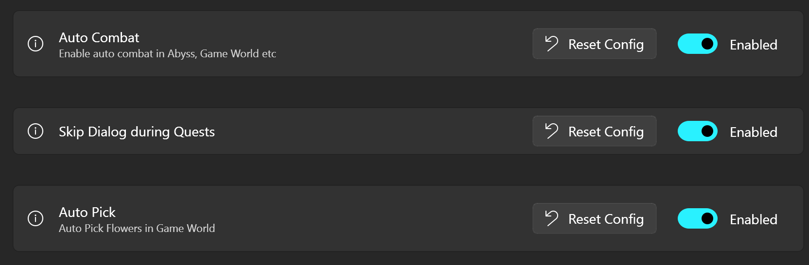

#  ok_baijing

白荆自动漫巡辅助脚本
视频演示 [https://www.bilibili.com/video/BV1K7421f7KT/](https://www.bilibili.com/video/BV1K7421f7KT/)

[报告BUG](https://github.com/ok-oldking/ok-baijing/issues/new?assignees=ok-oldking&labels=bug&projects=&template=%E6%8A%A5%E5%91%8Abug-.md&title=%5BBUG%5D)

QQ群594495691 [OK白荆回廊自动漫巡辅助](https://qm.qq.com/q/aGO7eBJ2Uw)



* 基于[ok-script](https://github.com/ok-oldking/ok-script)开发, 完全使用OCR文字识别开发
* 支持PC版, 以及安卓模拟器或使用adb连接的安卓物理机
* 可以指定角色凹指定技能个数, 循环n次, 直到刷到技能
* 如果没有刷到技能就, 自动投降新开

## 使用方法

### windows版本运行

1. 从[Github Release](https://github.com/ok-oldking/ok_baijing/releases)下载最新版, 双击运行.exe, 杀毒软件可能会报警,
   添加安装目录到白名单
2. 进入游戏漫巡界面, 设置全部为简化
   
3. 先选择窗口, 点击运行
   
4. 选择任务运行
   

### 注意事项

* PC版游戏窗口必须处于前台脚本才会运行, 不支持后台挂机
* PC版脚本程序必须右键管理员运行, 否则没有权限点击窗口
* 安卓版支持后台挂机, 最好不要使用管理员运行, 否则可能侦测不到模拟器
* 安卓版可以识别主流模拟器, 以及可以通过ADB查找到的设备

### Python源码运行和开发

```
pip install -r requirements.txt
python main.py
```

* main_debug.py 是开启debug日志的, 以及OverlayView, 并且每次点击都会截图保存在click_screenshot
* main_debug_console.py 是未开启gui界面的版本
* 默认使用CPU进行OCR, 识别耗时大约300-400ms, 如果要使用GPU, 请参见RapidOCR文档, 安装GPU版依赖

### 常见的问题

#### 1. 分辨率支持

由于都是按窗口百分比计算的, 只支持16：9，1080p,2k,4k都行

#### 2. 发现Bug怎么办

可以直接提ISSUE, 附上截图和日志, 日志在logs文件夹, 错误截图在screenshot里

#### 3. 是否免费

一直免费, 我还没退坑的话, 就会一直更新

  
